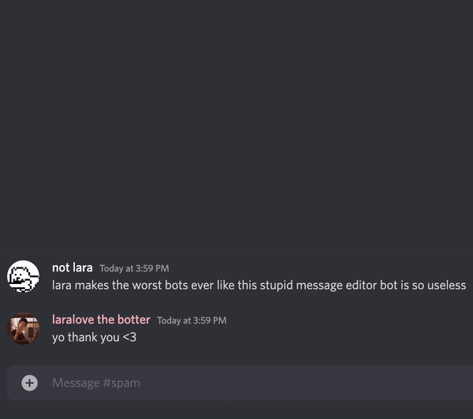

# edit any message
  

i'm a discord bot that lets you edit other people's messages!

## terms of service

- _"i" refers to lara kayaalp, the developer of edit any message_
- _"you" refers to all users of the bot_

### privacy

- none of your data is saved

### disclaimers

- the webhooks the bot executes copy the edited message's nickname and avatar
- i am not responsible for this copied data or the updated message content
- i am the sole owner and developer of this bot
- the hosted application is built directly from this repo

### self-hosting

these clauses override all other licenses:

- _"you" refers to the self-hoster of the bot_
- you may not advertise the self-hosted bot, such as in app directory
or on websites such as top.gg
- the self-hosted bot may not be in over 5 guilds
- you must direct the feedback/support requests to me
